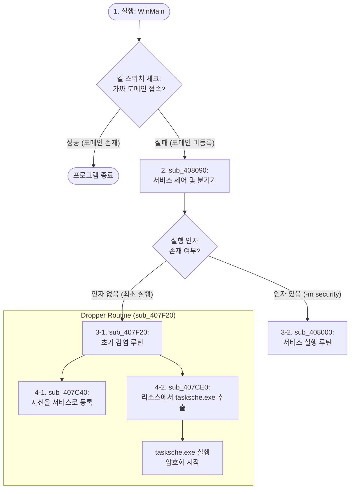
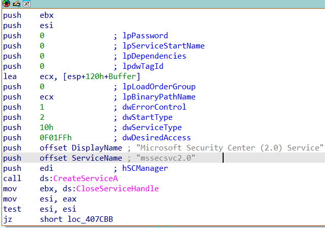
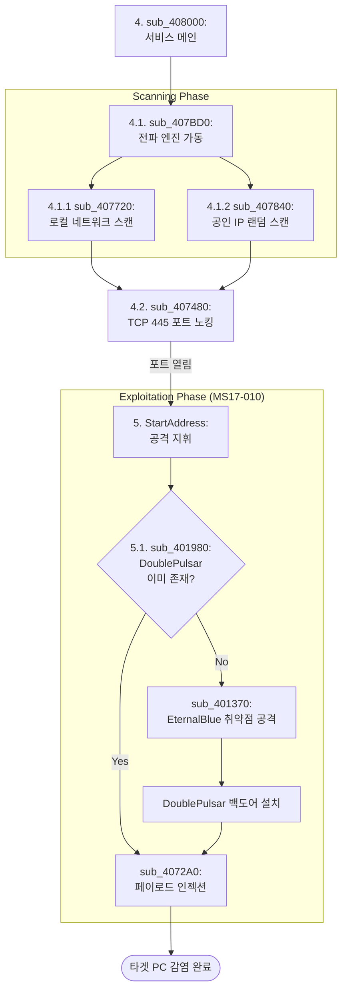

# Malware Analysis Report: WannaCry (Worm & Dropper)

- 분석 대상: 워너크라이(WannaCry) 전파 및 드로퍼 모듈 (mssecsvc.exe 모체)
- 분석 환경: IDA 9.0
- 작성일: 2026년 1월 30일 
- 주요 특징: 킬 스위치, 서비스 등록, SMB 취약점(MS17-010) 이용 자가 전파

## 목차
1. [동작 흐름](#1-동작-흐름)
2. [초기 실행 단계](#2-초기-실행-단계-킬-스위치-winmain)
3. [지속성 확보 및 페이로드 추출](#3-지속성-확보-및-페이로드-추출-dropper)
4. [네트워크 전파 메커니즘](#4-네트워크-전파-메커니즘-sub_408000)
5. [smb 취약점 공격 지휘](#5-smb-취약점-공격-지휘-startaddress)

## 1. 동작 흐름

1. [WinMain](./Pseudocode/WinMain) : 킬 스위치 도메인이 **없으면** 실행

2. [sub_408090](./Pseudocode/sub_408090) : 서비스를 등록하고 `sub_408000`을 실행

3-1. [sub_407F20](./Pseudocode/sub_407F20) : 초기 감염 루틴

3-2. [sub_408000](./Pseudocode/sub_408000) : 서비스 실행 루틴

4-1. [sub_407C40](./Pseudocode/sub_407C40) : 자신을 서비스로 등록

4-2. [sub_407CE0](./Pseudocode/sub_407CE0) : 리소스에서 tasksche.exe 추출

## 2. 초기 실행 단계: 킬 스위치 [(WinMain)](./Pseudocode/WinMain)
### 2.1. 킬 스위치 도메인 설정
```c
strcpy(szUrl, "http://www.iuqerfsodp9ifjaposdfjhgosurijfaewrwergwea.com");
```
공격자는 당시 등록되어 있지 않은 의미 없는 긴 문자열의 도메인을 코드에 하드코딩 해 두었다.
### 2.2. 네트워크 연결 시도
```c
v4 = InternetOpenA(0, 1u, 0, 0, 0); 
InternetOpenUrlA(v4, szUrl, 0, 0, 0x84000000, 0);
```
+ `InternetOpenA` : 인터넷 연결을 초기화한다.
+ `InternetOpenUrlA` : 1.1에서 설정한 szURL에 대한 연결을 설정하고 요청을 보낸다.
    + 이 함수는 도메인이 응답하면 핸들을 반환하고, 실패하면 `NULL`을 반환한다.

### 2.3. 실행 분기점
의사코드에는 생략되어 있으나 어셈블리 코드를 확인하면 아래와 같다.
```assembly
call    ds:InternetOpenUrlA
mov     edi, eax        ; InternetOpenUrlA의 결과를 edi에 저장
push    esi             ; hInternet 핸들 정리
mov     esi, ds:InternetCloseHandle
test    edi, edi        ; 접속 결과가 성공(Not NULL)인지 확인
jmp     short $+2       ; 다음 명령어(sub_408090) 이동
```

> 영국의 보안 전문가 Marcus Hutchins(MalwareTech)가 해당 도메인이 등록되어 있지 않음을 발견하고, 이 도메인을 직접 등록해 버렸습니다.

> 이후 전 세계의 워너크라이 샘플들이 도메인 접속에 성공하게 되었고, `sub_408090()`를 실행하지 않고 종료되면서 확산이 급격히 멈추게 되었습니다.

## 3. 지속성 확보 및 페이로드 추출 (Dropper)

킬 스위치를 통과하면 시스템에 자신을 고착화하고 실제 랜섬웨어 본체를 꺼낸다.

### 3.1. 서비스 제어 및 분기 [(sub_408090)](./Pseudocode/sub_408090)
이 함수는 프로그램의 실행 모드를 결정하는 메인 컨트롤러 역할을 한다.
+ 인자값 체크 : `_p___argc() < 2 `를 통해 실행 시 인자값이 있는지 확인한다. 인자가 없다면 처음 실행된 것으로 간주하고 설치 루틴(`sub_407F20`)을 호출한다.
+ 서비스 시작 : 인자가 있다면 `StartServiceCtrlDispatcherA`를 호출하여 자신을 Windows 서비스로 구동시킨다. 이때 실제 서비스 로직인 [`sub_408000`](./Pseudocode/sub_408000)이 실행된다.

### 3.2 서비스 등록 [(sub_407C40)](./Pseudocode/sub_407C40)
시스템이 재부팅되어도 악성코드가 계속 실행되도록 자신을 서비스로 등록한다.

+ 명령행 구성 : 자신을 실행할 때 `-m security`라는 인자를 붙이도록 설정한다.
```c
  sprintf(Buffer, "%s -m security", FileName);
```
+ 서비스 생성 : `CreateServiceA`를 통해 자신을 **"Microsoft Security Center (2.0) Service"**라는 이름의 서비스로 등록한다.
+ 즉시 실행 : 등록하자마자 `StartServiceA`를 호출하여 서비스를 즉시 시작한다.


### 3.3 리소스 추출 및 실행 [(sub_407CE0)](./Pseudocode/sub_407CE0)

자신의 몸체 안에 있는 리소스 섹션에서 암호화된 데이터를 로드하고 이를 C:\WINDOWS\tasksche.exe 경로에 파일로 생성(Drop)하고 실행한다.

+ 동적 API 로딩 : 보안 솔류션의 탐지를 피하기 위해 `GetProcAddress`를 사용하여 `CreateProcessA`, `WriteFile` 등의 함수 주소를 동적으로 가져온다.
+ 리소스 추출 : 자신의 리소스 섹션에서 ID 0x727(`tasksche.exe`)을 찾아낸다.
+ 파일 드롭 : `C:\WINDOWS\tasksche.exe` 경로에 파일로 생성(Drop)한다.
    + 만약 기존 파일이 있다면 `MoveFileExA`를 이용해 이름을 `qeriuwjhrf`로 바꾸어 백업하거나 덮어쓴다.
+ 최종 실행 : `CreateProcessA`를 호출하여 추출한 `tasksche.exe`를 실행한다.

## 4. 네트워크 전파 메커니즘 [(sub_408000)](./Pseudocode/sub_408000)
이 함수는 표준적인 Windows 서비스 메인 함수의 형태를 띠고 있다.


1. 서비스 상태 설정 : `ServiceStatus.dwCurrentState = 2;` (SERVICE_START_PENDING)로 시작하여 핸들러로 등록한 뒤 `4`(SERVICE_RUNNING)로 변경한다.
2. 핵심 실행 루틴 호출 : 서비스가 실행중 상태(`4`)가 되자마자 [`sub_407BD0()`](#41-멀티스레드-전파-엔진-sub_407bd0)를 호출한다.
3. 지연 및 종료 : `Sleep(0x5265C00u);` 약 24시간 동안 대기한 후 프로세스를 종료한다.

### 4.1. 멀티스레드 전파 엔진 [(sub_407BD0)](./Pseudocode/sub_407BD0)

#### 4.1.1 로컬 네트워크 스캐닝 [(sub_407720)](./Pseudocode/sub_407720)
이 함수는 현재 감염된 PC와 같은 네트워크에 있는 다른 PC들을 찾아낸다.

+ 정보 수집 [(sub_409160)](./Pseudocode/sub_409160) : 감염됨 PC의 IP 주소와 서브넷 마스크 정보를 가져온다.

+ 스레드 조절
```c
 if ( *(int *)&FileName[268] > 10 )
    {
      do
        Sleep(0x64u);
      while ( *(int *)&FileName[268] > 10 );
      v1 = (void **)v10;
    }
```
+ 공격 스레드 생성([`sub_4076B0`](./Pseudocode/sub_4076B0)) : 로컬 IP 리스트를 순회하며 `sub_4076B0` 함수를 실행한다. 이 함수가 445번 포트를 찌르며 SMB 취약점을 이용한다.

#### 4.1.2 공인 IP 무작위 스캐닝 [(sub_407840)](./Pseudocode/sub_407840)
이 함수는 무작위 IP 주소를 생성하여 공격 대상을 찾는다.
+ 랜덤 IP todtjd (`srand`,`sub_407660`): `GetTickCount`와 `Time` 등을 조합해 난수 시드를 만들고 무작위 IP 주소를 생성한다.
+ 필터링 : 루프 내에서 특정 대역은 피한다.
    + `v6 == 127` : 루프백 주소 제외
    + `v6 >= 224` : 멀티캐스트 및 예약된 IP 대역 제외.
+ 서브넷 응답 스레드 생성 : `sub_407480` 함수로 무작위로 하나의 IP를 찍어보고 응답이 있다면 해당 대역의 마지막 자리(1~254)를 전부 훑으며 공격 스레드를 생성한다.
```c
sprintf(Buffer, "%d.%d.%d.%d", v6, v16, v7, v10); // 마지막 옥텟(v10)을 1부터 254까지 증가
```
### 4.2. 445번 포트 노킹 [(`sub_407480`)](./Pseudocode/sub_407480)
이 함수는 특정 IP의 TCP 445번 포트(SMB)가 열려 있는지 확인하는 스캐너다.

+ 타겟 포트 설정
```c
 *(_WORD *)name.sa_data = htons(0x1BDu); //0x1BDu는 10진수로 445
```
+ `sub_407840`이 `1`(성공)을 반환하면 `StartAddress` 함수를 스레드로 실행한다. 이 함수가 **EternalBlue(MS17-010)** 익스플로잇을 동작한다.

## 5. SMB 취약점 공격 지휘 [(StartAddress)](./Pseudocode/StartAddress)
이 함수는 [`백도어 확인` -> `취약점 공격` -> `페이로드 전송`] 과정을 반복한다.
```c
  if ( sub_401980(Destination, 0x1BDu) ) //백도어 선 확인 (0x1BDu=445)
  {
    for ( i = 0; i < 5; ++i ) //공격 재시도 루프
    {
      Sleep(0xBB8u);
      if ( sub_401B70(Destination, 1, 0x1BDu) ) //익스플로잇 시도
        break;
      Sleep(0xBB8u);
      sub_401370(Destination, 0x1BDu); //익스플로잇 시도
    }
  }
```
+ `0x1BDu`(445번 포트)를 대상으로 공격을 수행하는 루틴이다.
+ 최대 5회(`i < 5`)재시도하는 로직을 통해 공격의 성공률을 높이려 한다.

### 5.1. 백도어 존재 여부 확인 ([sub_401B70](./Pseudocode/sub_401B70), [sub_401980](./Pseudocode/sub_401980))
```c
if ( send(v4, byte_42E6BC, 82, 0) != -1 && recv(v4, buf, 1024, 0) != -1 && buf[34] == 81 )
```
+ 응답 패킷(`buf`)의 34번째 오프셋(MID Field)이 `81`(0x51)인지 체크한다.
+ 이는 알려진 DoublePulsar 백도어의 Ping 응답 규약과 일치한다.

```c
if ( send(v3, byte_42E4F4, 78, 0) != -1
          && recv(v3, buf, 1024, 0) != -1
          && buf[9] == 5    // 0x05
          && buf[10] == 2   // 0x02
          && !buf[11]       // 0x00
          && buf[12] == -64 )   // 0xC0
```
+ 또한 `sub_401980`에서는 `buf[9]` 부터 `buf[12]`까지 4바이트(Status Field)를 체크하고 있다. 이를 리틀 엔디언 방식으로 합치면 `0xC0000205` 값이 나온다.
+ `0xC0000205`는 Windows의 NT_STATUS 코드 중 `STATUS_INSUFF_SERVER_RESOURCES`를 의미한다.
+ 이 값을 반환하면 대상 PC는 SMB 취약점에 대한 업데이트가 되지 않은 경우(취약한 경우)라고 판단한다.


+ 따라서 이 함수는 타겟에 이미 백도어가 심어져 있는지 판별하는 역할을 수행한다고 결론지을 수 있다.
### 4.2. EternalBlue 익스플로잇 [(sub_401370)](./Pseudocode/sub_401370)
```c
v20 = *((double *)v2 + 1252) * 1000.0; // 1. 정밀한 타이밍 계산
sub_401660((LARGE_INTEGER)(__int64)(v3 * 1000.0)); // 2. 마이크로초 단위 대기
v6 = sub_401190(v2 + 6, *((_DWORD *)v2 + 2), buf, &v7, &v9); // 3. 패킷 조립 및 전송
```
+ `v2` 구조체에 담긴 SMB 템플릿과 `double`형을 이용한 정밀한 타이밍 제어가 특징이다.
+ 이는 SMB 프로토콜의 취약점을 이용해 커널 메모리 내에서 Race Condition을 유발하기 위한 전형적인 설계로 보인다.


### 4.5. 최종 페이로드 주입 [(sub_4072A0)](./Pseudocode/sub_4072A0)
```c
v6 = *(_DWORD *)&buf[18];  // 1. 타겟 아키텍처 정보(x86/x64) 결정
v7 = sub_406EB0(*(_DWORD *)&buf[18], *(_DWORD *)&buf[22]); // 2. DoublePulsar XOR 키 생성
sub_406F50(v4, v7, v8);    // 3. 페이로드 주입
```
+ 백도어 응답 패킷의 특정 오프셋(18, 22)에서 데이터를 읽어 침투한 시스템의 운영체제 정보를 파악한다.
+ 파악된 정보를 바탕으로 `sub_406EB0`에서 적절한 쉘코드를 생성한다.
+ 최종적으로 백도어를 통해 워너크라이 복제본(`mssecsvc.exe`)을 타겟의 메모리에 injection하는 최종 단계다.
