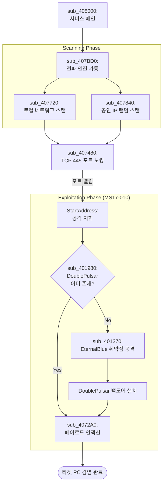

# Malware Analysis Report: WannaCry (Worm & Dropper)

- 분석 대상: 워너크라이(WannaCry) 전파 및 드로퍼 모듈 (mssecsvc.exe 모체)
- 작성일: 2026년 1월 30일 
- 주요 특징: 킬 스위치, 서비스 등록, SMB 취약점(MS17-010) 이용 자가 전파

## 목차
1. [동작 흐름](#1-동작-흐름)
2. [초기 실행 단계](#2-초기-실행-단계-킬-스위치-winmain)
3. [지속성 확보 및 페이로드 추출](#3-지속성-확보-및-페이로드-추출-dropper)
4. 

## 1. 동작 흐름

1. [WinMain](./Pseudocode/WinMain) : 킬 스위치 도메인이 **없으면** 실행

2. [sub_408090](./Pseudocode/sub_408090) : 서비스를 등록하고 `sub_408000`을 실행

3-1. [sub_407F20](./Pseudocode/sub_407F20) : 초기 감염 루틴

3-2. [sub_408000](./Pseudocode/sub_408000) : 서비스 실행 루틴

4-1. [sub_407C40](./Pseudocode/sub_407C40) : 자신을 서비스로 등록

4-2. [sub_407CE0](./Pseudocode/sub_407CE0) : 리소스에서 tasksche.exe 추출

## 2. 초기 실행 단계: 킬 스위치 [(WinMain)](./Pseudocode/WinMain)
### 2.1. 킬 스위치 도메인 설정
```c
strcpy(szUrl, "http://www.iuqerfsodp9ifjaposdfjhgosurijfaewrwergwea.com");
```
공격자는 당시 등록되어 있지 않은 의미 없는 긴 문자열의 도메인을 코드에 하드코딩 해 두었다.
### 2.2. 네트워크 연결 시도
```c
v4 = InternetOpenA(0, 1u, 0, 0, 0); 
InternetOpenUrlA(v4, szUrl, 0, 0, 0x84000000, 0);
```
+ `InternetOpenA` : 인터넷 연결을 초기화한다.
+ `InternetOpenUrlA` : 1.1에서 설정한 szURL에 대한 연결을 설정하고 요청을 보낸다.
    + 이 함수는 도메인이 응답하면 핸들을 반환하고, 실패하면 `NULL`을 반환한다.

### 2.3. 실행 분기점
의사코드에는 생략되어 있으나 어셈블리 코드를 확인하면 아래와 같다.
```assembly
call    ds:InternetOpenUrlA
mov     edi, eax        ; InternetOpenUrlA의 결과를 edi에 저장
push    esi             ; hInternet 핸들 정리
mov     esi, ds:InternetCloseHandle
test    edi, edi        ; 접속 결과가 성공(Not NULL)인지 확인
jmp     short $+2       ; 다음 명령어 이동
```

## 3. 지속성 확보 및 페이로드 추출 (Dropper)

킬 스위치를 통과하면 시스템에 자신을 고착화하고 실제 랜섬웨어 본체를 꺼낸다.

### 3.1. 서비스 제어 및 분기 [(sub_408090)](./Pseudocode/sub_408090)
이 함수는 프로그램의 실행 모드를 결정하는 메인 컨트롤러 역할을 한다.
+ 인자값 체크 : `_p___argc() < 2 `를 통해 실행 시 인자값이 있는지 확인한다. 인자가 없다면 처음 실행된 것으로 간주하고 설치 루틴(`sub_407F20`)을 호출한다.
+ 서비스 시작 : 인자가 있다면 `StartServiceCtrlDispatcherA`를 호출하여 자신을 Windows 서비스로 구동시킨다. 이때 실제 서비스 로직인 [`sub_408000`](./Pseudocode/sub_408000)이 실행된다.

### 3.2 서비스 등록 [(sub_407C40)](./Pseudocode/sub_407C40)
시스템이 재부팅되어도 악성코드가 계속 실행되도록 자신을 서비스로 등록한다.

+ 명령행 구성 : 자신을 실행할 때 `-m security`라는 인자를 붙이도록 설정한다.
```c
  sprintf(Buffer, "%s -m security", FileName);
```
+ 서비스 생성 : `CreateServiceA`를 통해 자신을 **"Microsoft Security Center (2.0) Service"**라는 이름의 서비스로 등록한다.
+ 즉시 실행 : 등록하자마자 `StartServiceA`를 호출하여 서비스를 즉시 시작한다.

### 3.3 리소스 추출 및 실행 [(sub_407CE0)](./Pseudocode/sub_407CE0)

자신의 몸체 안에 있는 리소스 섹션에서 암호화된 데이터를 로드하고 이를 C:\WINDOWS\tasksche.exe 경로에 파일로 생성(Drop)하고 실행한다.

+ 동적 API 로딩 : 보안 솔류션의 탐지를 피하기 위해 `GetProcAddress`를 사용하여 `CreateProcessA`, `WriteFile` 등의 함수 주소를 동적으로 가져온다.
+ 리소스 추출 : 자신의 리소스 섹션에서 ID 0x727(`tasksche.exe`)을 찾아낸다.
+ 파일 드롭 : `C:\WINDOWS\tasksche.exe` 경로에 파일로 생성(Drop)한다.
    + 만약 기존 파일이 있다면 `MoveFileExA`를 이용해 이름을 `qeriuwjhrf`로 바꾸어 백업하거나 덮어쓴다.
+ 최종 실행 : `CreateProcessA`를 호출하여 추출한 `tasksche.exe`를 실행한다.

## 4. 네트워크 전파 메커니즘 [(sub_408000)](./Pseudocode/sub_408000)
이 함수는 표준적인 Windows 서비스 메인 함수의 형태를 띠고 있다.


1. 서비스 상태 설정 : `ServiceStatus.dwCurrentState = 2;` (SERVICE_START_PENDING)로 시작하여 핸들러로 등록한 뒤 `4`(SERVICE_RUNNING)로 변경한다.
2. 핵심 실행 루틴 호출 : 서비스가 실행중 상태(`4`)가 되자마자 [`sub_407BD0()`](#41-멀티스레드-전파-엔진-sub_407bd0)를 호출한다.
3. 지연 및 종료 : `Sleep(0x5265C00u);` 약 24시간 동안 대기한 후 프로세스를 종료한다.

### 4.1. 멀티스레드 전파 엔진 [(sub_407BD0)](./Pseudocode/sub_407BD0)

#### 4.1.1 로컬 네트워크 스캐닝 [(sub_407720)](./Pseudocode/sub_407720)
이 함수는 현재 감염된 PC와 같은 네트워크에 있는 다른 PC들을 찾아낸다.

+ 정보 수집 [(sub_409160)](./Pseudocode/sub_409160) : 감염됨 PC의 IP 주소와 서브넷 마스크 정보를 가져온다.

+ 스레드 조절
```c
 if ( *(int *)&FileName[268] > 10 )
    {
      do
        Sleep(0x64u);
      while ( *(int *)&FileName[268] > 10 );
      v1 = (void **)v10;
    }
```
+ 공격 스레드 생성([`sub_4076B0`](./Pseudocode/sub_4076B0)) : 로컬 IP 리스트를 순회하며 `sub_4076B0` 함수를 실행한다. 이 함수가 445번 포트를 찌르며 SMB 취약점을 이용한다.

#### 4.1.2 공인 IP 무작위 스캐닝 [(sub_407840)](./Pseudocode/sub_407840)
이 함수는 무작위 IP 주소를 생성하여 공격 대상을 찾는다.
+ 랜덤 IP todtjd (`srand`,`sub_407660`): `GetTickCount`와 `Time` 등을 조합해 난수 시드를 만들고 무작위 IP 주소를 생성한다.
+ 필터링 : 루프 내에서 특정 대역은 피한다.
    + `v6 == 127` : 루프백 주소 제외
    + `v6 >= 224` : 멀티캐스트 및 예약된 IP 대역 제외.
+ 서브넷 응답 스레드 생성 : `sub_407480` 함수로 무작위로 하나의 IP를 찍어보고 응답이 있다면 해당 대역의 마지막 자리(1~254)를 전부 훑으며 공격 스레드를 생성한다.
```c
sprintf(Buffer, "%d.%d.%d.%d", v6, v16, v7, v10); // 마지막 옥텟(v10)을 1부터 254까지 증가
```


######################################################
    LAN 스캔 (sub_407720): 현재 감염된 PC가 속한 로컬 네트워크 대역을 꼼꼼하게 스캔합니다. (최대 10개 스레드)

    WAN 스캔 (sub_407840): 임의의 공인 IP 주소를 무작위로 생성하여 전 세계 인터넷을 대상으로 스캔합니다. (128개 스레드)

### 4.2 포트 확인 (sub_407480)

    타겟 IP의 TCP 445(SMB) 포트가 열려 있는지 확인합니다.

    비동기 소켓 연결을 사용하여 단 1초만 대기하는 고속 스캐닝 방식을 채택했습니다.

## 5. 취약점 공격 및 침투 (Exploitation)

포트가 열린 타겟을 발견하면, NSA에서 유출된 것으로 알려진 강력한 무기들을 사용합니다.
### 5.1 백도어 체크 및 세션 수립 (sub_401B70)

    타겟에 이미 DoublePulsar 백도어가 심어져 있는지 확인합니다. (0x51 응답 체크)

    동시에 타겟의 SMB 응답에서 TID(Tree ID), UID(User ID) 등을 추출하여 다음 공격 패킷을 위해 저장합니다.

### 5.2 EternalBlue 익스플로잇 (sub_401370)

    MS17-010 취약점을 이용해 타겟의 커널 권한을 탈취합니다.

    **상태 머신(State Machine)**을 통해 복잡한 SMB 패킷 시퀀스를 관리하며, 마이크로초 단위의 타이밍 조절로 레이스 컨디션을 유도합니다.

## 6. 최종 감염 (Self-Replication)

침투에 성공하면 마지막으로 자신의 복제본을 전달합니다.

    페이로드 주입 (sub_4072A0): 타겟 시스템의 아키텍처(x86/x64)를 파악하고 그에 맞는 쉘코드를 전송합니다.

    전이: 타겟 시스템 메모리에서 실행된 쉘코드는 원본 mssecsvc.exe를 다운로드하고 실행하여, 해당 시스템을 새로운 숙주로 만듭니다.

## 7. 결론 및 향후 분석 계획

본 모듈은 스스로를 복제하고 전파하는 **'운송 수단'**에 가깝습니다. 실제 사용자에게 피해를 주는 '폭탄'은 리소스에서 추출된 tasksche.exe입니다.

    현재까지의 성과: 킬 스위치부터 SMB 익스플로잇을 통한 전파 과정까지 완벽히 분석 완료.

    다음 단계: tasksche.exe 내부의 파일 암호화 로직(AES/RSA), 비트코인 결제 안내 창(GUI) 생성 루틴, 그리고 암호화 제외 대상 확장자 등을 분석할 예정입니다.
